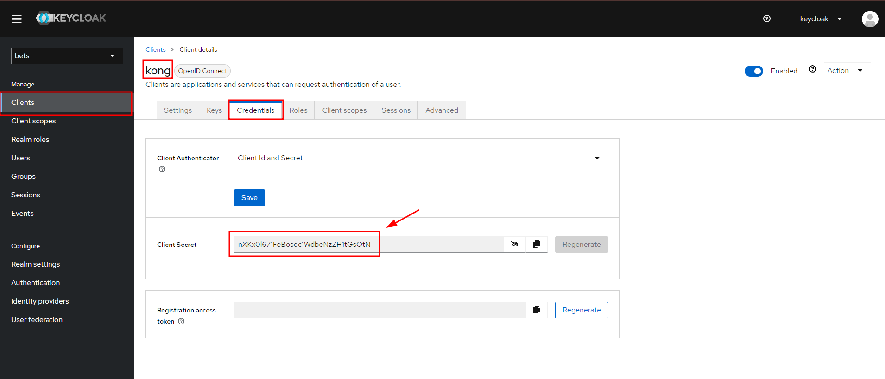

# Kong e k8s

### O que é Kubernetes Ingress ?

É a maneira de _**realizar a exposição de rotas**_ **HTTP** e **HTTPS** para fora do cluster. Este roteamento de tráfego é controlado
por regras definidas dentro do recurso Ingress do k8s.

O **Kong Ingress Controller** é uma implementação do Kong que **atua como um controlador de Ingress para o Kubernetes**,
permitindo que você **configure facilmente regras de roteamento de tráfego** para seus serviços do k8s.

Em resumo, o Kong Ingress Controller **facilita a integração** do Kong com o Kubernetes, permitindo um gerenciamento mais
eficiente do tráfego de entrada para os serviços dentro do cluster.

### Modelo de deployment via banco de dados (Não recomendado)

No modelo de deployment via banco de dados no Kong API, as configurações do Kong são armazenadas no **banco
de dados** em vez de serem definidas diretamente nos arquivos de configuração.
> O fluxo de configuração são as setas vermelhas e as setas verdes são o fluxo de cliente

### Modelo de deployment via db-less (Recomendado)

---

## Instalação

Itens necessários:

- kind;
- kubectl;
- helm v3;

### Com os programas acima instalados...

Caso esteja no Windows, execute os comandos abaixo com o Git Bash.

**Vamos subir o Cluster:**

Abra o seu terminal na pasta `infra/kong-k8s/kind` e execute o comando: `./kind.sh`.

E com o comando: `kubectl get pods -A`, você poderá ver os pods do kind subiram.

**Vamos subir o Kong:**

Abra o seu terminal na pasta `infra/kong-k8s/kong` e execute o comando: `./kong.sh`.

E com o comando: `kubectl get pods -n kong`, você poderá ver se os pods do kong subiram.

**Vamos subir o Prometheus:**

Abra o seu terminal na pasta `infra/kong-k8s/misc/prometheus` e execute o comando: `./prometheus.sh`.

E com o comando: `kubectl get pods -n monitoring`, você poderá ver se os pods do prometheus subiram.

**Vamos subir o KeyCloak:**

Abra o seu terminal na pasta `infra/kong-k8s/misc/keycloak` e execute o comando: `./keycloak.sh`.

E com o comando: `kubectl get pods -n iam`, você poderá ver se os pods do keycloak subiram.

### Subindo as aplicações back-end

Para subir os containers do serviço de apostas bets, siga os passos abaixo:

Abra um terminal e execute o comando: `kubectl create ns bets`.

Agora, copie o path completo da pasta: `infra/kong-k8s/misc/apps` e cole no comando:
`kubectl apply -f {path} --recursive -n bets`.

---

## Configurando os plugins do Kong pelo k8s

**Vamos configurar o plugin de rate limit por header:**

Copie o path completo do arquivo: `infra/kong-k8s/misc/apis/kratelimit.yaml`.

Abra um terminal  e execute o comando com path acima: `kubectl apply -f {path} -n bets`.

**Vamos configurar o plugin de prometheus globalmente:**

Copie o path completo do arquivo: `infra/kong-k8s/misc/apis/kprometheus.yaml`.

Abra um terminal e execute o comando com path acima: `kubectl apply -f {path}`.

### Configurando o Ingress

Responsável por configurar regras de roteamento de tráfego para serviços dentro do cluster Kubernetes.

Para isso utilizaremos o arquivo: `infra/kong-k8s/misc/apis/bets-api.yaml`, copie o path completo.

Abra um terminal e execute o comando com path acima: `kubectl apply -f {path} -n bets`.

**Agora vamos configurar para utilizar o mecanismo de service do Kubernetes:**

> Lembrando que deixamos a linha dos plugins comentados no `bets-api.yaml`.
> 

Para isso utilizaremos o arquivo: `infra/kong-k8s/misc/apis/king.yaml`, copie o path completo.

Abra um terminal e execute o comando com path acima: `kubectl apply -f {path} -n bets`.

Podemos utilizar o Postman para testar:

---

### Configurando o OpenID Connect

Vamos utilizar o KeyCloak para realizar a autenticação e podemos ver que ele já está rodando em nossos serviços com o
comando: `kubectl get svc -n iam`.

Primeiro, faça um **port forward** para sua máquina com o comando: `kubectl port-forward svc/keycloak 8080:80 -n iam`.

Em seu navegador, acesse: `localhost:8080` e o **login/senha**: `keycloak`.

Crie um **novo realm**:

Crie 2 usuários na aba **Users** e crie uma senha para cada na aba de **Credentials**.
> Para evitar erros futuros, deixe o campo **Email verified** = true e preencha os campos de **Email, First e Last Name**

Crie um **client** do kong:
> **Valid redirect URIs** = *
> 
> **Client authentication** = true

Vamos copiar a secret do Client **Kong**:

No arquivo: `infra/kong-k8s/misc/apis/kopenid.yaml`, **cole sua nova Secret Key:**

Vamos aplicar o OpenID Connect no Cluster com o comando: `kubectl apply -f {path} -n bets`.

No arquivo `infra/kong-k8s/misc/apis/bets-api.yaml`, **mude a linha 8** para:

E **aplique a configuração** com o comando: `kubectl apply -f {path} -n bets`.

A partir de agora, receberemos `Unauthorized` ao fazer **requisições sem autenticação**:

**Para conseguirmos realizar uma requisição, precisaremos ter um token válido, para isso siga os passos abaixo:**

1- Abra a pasta no terminal: `infra/kong-k8s/misc/token`.

2- Rode o comando no git Bash para criar o pod de buscar token: `./apply-token.sh`.

3- Acesse o pod com o comando: `kubectl exec -it testcurl -- sh`.

4- No arquivo: `get-token.sh`, troque o **login/senha** pelo usuário criado no Keycloak e o **Secret Key** do client kong:

Copie o **curl** acima e cole no terminal do pod:
> Caso ocorra erro de `Error: Invalid character in header content ["Authorization"]`, tente em outro terminal.

Com isso, configuramos a aba de `Authorization` e enviamos a requisição com sucesso:

---